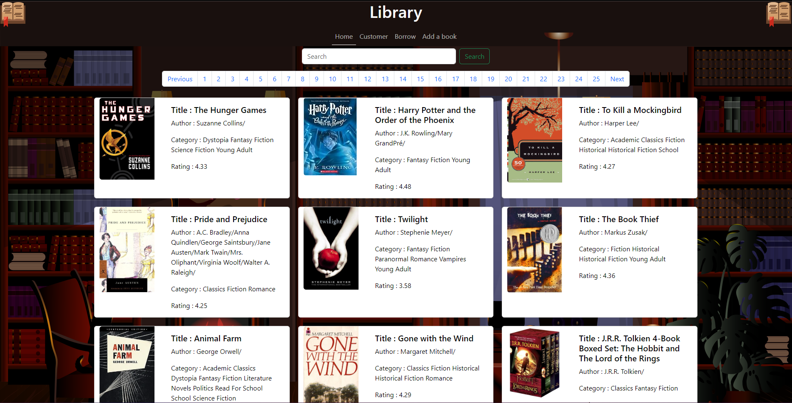
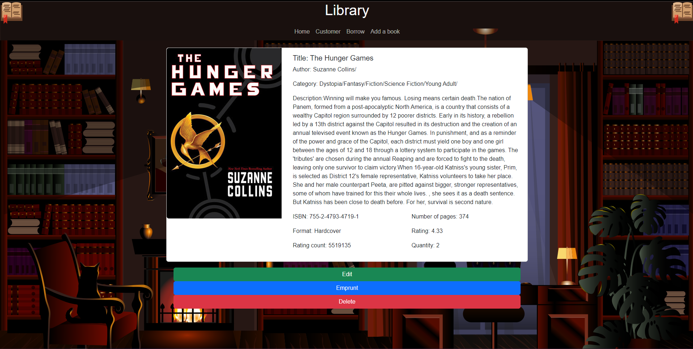

# Application de Gestion de Bibliothèque

L'**Application de Gestion de Bibliothèque** est une solution complète développée en PHP pour permettre aux bibliothécaires de gérer efficacement le catalogue de livres ainsi que les emprunts. Elle offre des fonctionnalités avancées pour simplifier la gestion d'une bibliothèque avec une base de données importante de 20 000 livres.

## Fonctionnalités

- **Gestion du Catalogue de Livres** :
  - Affichage de la liste des livres contenus dans le catalogue avec leur statut (disponible ou prêté).
  - Ajout de nouveaux livres au catalogue avec leurs détails (titre, auteur, résumé, date de parution, catégorie, etc.).
  - Suppression de livres du catalogue s'ils ne sont pas empruntés.

- **Gestion des Emprunts** :
  - Modification du statut de chaque livre, passant de disponible à prêté et vice versa.
  - Enregistrement de l'identifiant unique de l'utilisateur lors de l'emprunt d'un livre.
  - Affichage des informations du livre et de l'utilisateur sur la fiche descriptive du livre emprunté.

- **Gestion des Utilisateurs** :
  - Affichage de la liste de tous les utilisateurs enregistrés dans le système avec leurs informations personnelles.
  - Consultation des livres qu'un utilisateur a éventuellement empruntés en cliquant sur sa fiche personnelle.

## Capture d'écran

## Spécifications techniques

- **Architecture Orientée Objet (DAO)** : Organisation du code en utilisant des classes et des fonctions pour gérer les interactions avec la base de données.
- **Base de Données Conséquente** : Gestion d'une base de données importante de 52 000 livres pour une gestion efficace des emprunts et du catalogue.
- **Fonctionnalités Avancées** : Utilisation de la gestion d'emprunts, de la modification de statut des livres et de l'affichage des utilisateurs pour une gestion complète de la bibliothèque.

## Pour aller plus loin

- **Fonctionnalités de Tri** : Implémenter un système de tri pour organiser et afficher les livres par catégorie, auteur, etc.
- **Gestion des Dates** : Ajouter une gestion des dates pour le calcul automatique du temps restant avant le retour des emprunts.
- **Recherche Avancée** : Mettre en place une fonction de recherche avancée permettant aux bibliothécaires de trouver rapidement des livres spécifiques.
- **Interface Utilisateur Améliorée** : Améliorer l'interface utilisateur pour une expérience plus fluide et intuitive.

## Auteur

Lenoir Yohan
